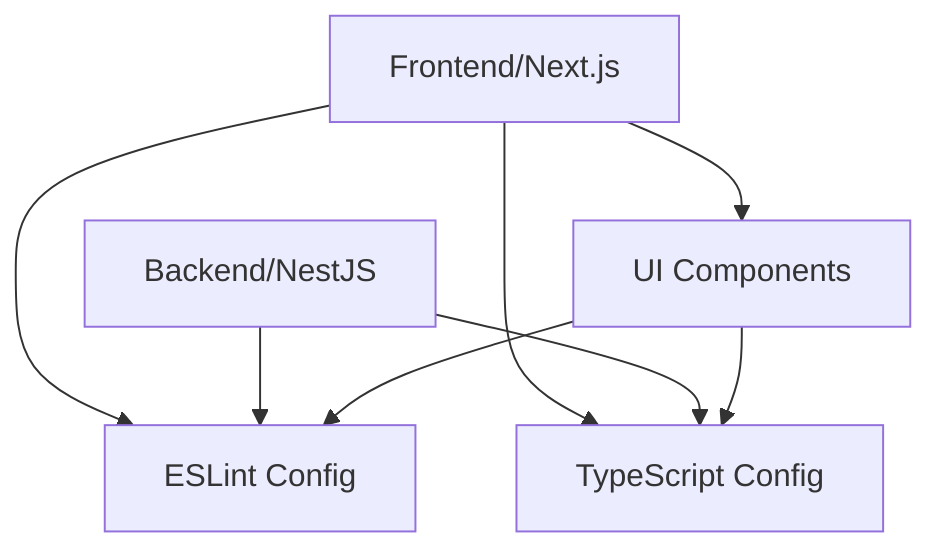

# Letskraack Architecture

This document provides an overview of the Letskraack application architecture, explaining how different modules interact with each other.

## Overview

Letskraack follows a monorepo architecture using Turborepo, with clear separation between applications and shared packages. This approach allows for code reuse while maintaining separation of concerns.

## System Architecture

```
┌─────────────────┐     ┌─────────────────┐
│                 │     │                 │
│  Next.js        │     │  NestJS         │
│  Frontend       │◄────┤  API Backend    │
│  (apps/web)     │     │  (apps/api)     │
│                 │     │                 │
└────────┬────────┘     └────────┬────────┘
         │                       │
         │                       │
┌────────▼─────────────────────▼─────────┐
│                                         │
│         Shared Packages                 │
│         (packages/*)                    │
│                                         │
└─────────────────────────────────────────┘
```

## Key Components

### 1. Frontend Application (apps/web)

- **Technology**: Next.js
- **Purpose**: User-facing web application
- **Key Features**:
  - React components for UI
  - Next.js routing for page navigation
  - API calls to backend services

### 2. API Backend (apps/api)

- **Technology**: NestJS
- **Purpose**: Provides API endpoints for the frontend
- **Key Features**:
  - RESTful API endpoints
  - Business logic
  - Database interactions
  - Authentication and authorization

### 3. Shared Packages

#### UI Components (packages/ui)
- Reusable React components
- Used by the frontend application
- Ensures consistent UI across the application

#### Configuration Packages
- **eslint-config**: Shared ESLint configurations
- **typescript-config**: Shared TypeScript configurations

## Data Flow

1. **User Interaction**: User interacts with the Next.js frontend
2. **API Requests**: Frontend makes API calls to the NestJS backend
3. **Data Processing**: Backend processes requests, interacts with the database
4. **Response**: Backend sends response back to frontend
5. **UI Update**: Frontend updates UI based on response

## Module Dependencies



## Future Architecture Considerations

- **Microservices**: As the application grows, consider splitting the backend into microservices
- **State Management**: Implement robust state management for complex UI interactions
- **Caching Layer**: Add caching for improved performance
- **Authentication Service**: Separate authentication concerns into a dedicated service

## Design Decisions

### Monorepo Structure
We chose a monorepo approach to:
- Enable code sharing between projects
- Ensure consistent tooling across projects
- Simplify dependency management
- Coordinate changes across packages and applications

### Technology Choices

- **Next.js**: For server-side rendering and improved SEO
- **NestJS**: For a structured, modular backend with strong TypeScript support
- **Turborepo**: For efficient builds and better developer experience in a monorepo
- **pnpm**: For efficient package management with workspace support

## Development Workflow

Developers typically work on features that span both frontend and backend:

1. Update shared packages if needed
2. Implement backend endpoints and logic
3. Implement frontend components and interactions
4. Test integration between layers